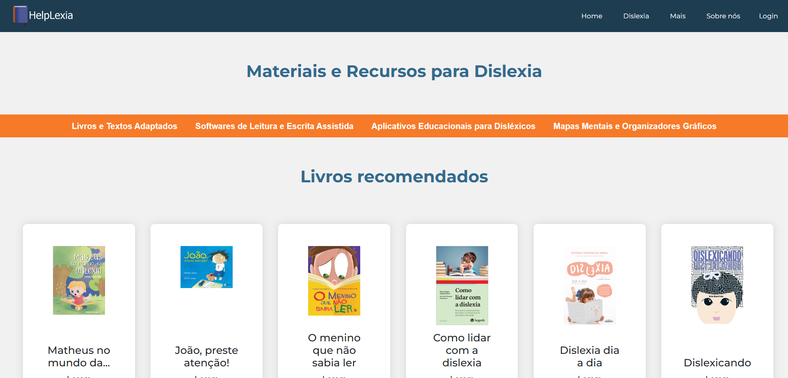

<h1 align="center">
 HelpLexi
</h1>
 

 HelpLexi, o site com tudo que você precisa saber sobre dislexia, dicas para aprendizado, o significado e até leis que portadores de dislexia tem direito.

 

 
<h4 align="center"><a href="https://github.com/GuNunesB/HelpLexi">Confira o projeto aqui</a></h4>

 
 

<h2 align="left">
 Feito por:
</h2>

<h3><a href="https://github.com/biavsf">Bianca Vieira.</a></h3>
<h3><a href="https://github.com/Askka01">Davi de Paula.</a></h3>
<h3><a href="https://github.com/GuNunesB">Gustavo Nunes.</a></h3>
<h3><a href="https://github.com/Pedrohrk0024">Pedro Rodrigues.</a></h3>
<h3><a href="https://github.com/billgtaes">Samuel de Paula.</a></h3>

<h2 align="left">
 Licença:
</h2>

The [MIT License](./LICENSE).
